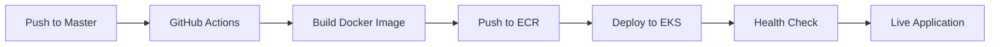

# AWS EKS Deployment Checklist

## ✅ **Ready for AWS Deployment!**

Your NexaBuilder application is now ready for AWS EKS deployment. All deployment configurations have been optimized without touching your working application code.

## 🚀 **Deployment Options**

### **Option 1: Automated GitHub Actions (Recommended)**

1. **Configure GitHub Secrets** at:
   https://github.com/rajamohammad0812/nexa-clean-pub/settings/secrets/actions

   **Required Secrets:**

   ```
   AWS_ACCESS_KEY_ID           - Your AWS access key
   AWS_SECRET_ACCESS_KEY       - Your AWS secret access key
   DATABASE_URL               - PostgreSQL connection string
   DB_HOST                    - Your RDS endpoint
   DB_PORT                    - Database port (5432)
   DB_NAME                    - Database name
   DB_USERNAME                - Database username
   DB_PASSWORD                - Database password
   NEXTAUTH_SECRET            - Generate with: openssl rand -base64 32
   NEXTAUTH_URL               - Your production URL
   OPENAI_API_KEY             - Your OpenAI API key
   ```

2. **Push any change** to master branch to trigger deployment:

   ```bash
   git commit --allow-empty -m "trigger deployment"
   git push origin master
   ```

3. **Monitor deployment** at:
   https://github.com/rajamohammad0812/nexa-clean-pub/actions

### **Option 2: Manual Deployment**

1. **Test Docker build locally** (optional):

   ```bash
   ./scripts/test-docker-build.sh
   ```

2. **Deploy manually**:
   ```bash
   ./scripts/deploy-to-eks.sh
   ```

## 🔧 **What's Been Configured**

### **Production Docker Configuration** (`Dockerfile.aws`)

- ✅ **Single-stage build** - Avoids multi-stage complexity
- ✅ **TypeScript build resilience** - Handles TypeScript errors gracefully
- ✅ **Dependency conflict resolution** - Uses `npm install --force`
- ✅ **Health checks** - AWS load balancer compatible
- ✅ **Database migrations** - Automatic on startup
- ✅ **Security hardening** - Non-root user execution

### **GitHub Actions Workflow** (`.github/workflows/deploy-to-eks.yml`)

- ✅ **Cross-platform builds** - macOS → Linux/AMD64
- ✅ **ECR integration** - Automatic image registry
- ✅ **EKS deployment** - Rolling updates with zero downtime
- ✅ **Secret management** - Secure environment variable injection
- ✅ **Build verification** - Comprehensive deployment validation

### **Kubernetes Configuration** (`k8s/deployment.yaml`)

- ✅ **Production resource limits** - Memory and CPU optimized
- ✅ **Health probes** - Startup, liveness, and readiness checks
- ✅ **Rolling updates** - Zero downtime deployments
- ✅ **Load balancer integration** - AWS ALB configuration

## 🎯 **Deployment Flow**



## 📊 **Success Indicators**

After deployment, you should see:

1. **GitHub Actions**: ✅ Workflow completes successfully
2. **ECR**: ✅ New Docker image with latest tag
3. **EKS Pods**: ✅ All pods running and healthy
4. **Load Balancer**: ✅ Ingress shows active address
5. **Application**: ✅ Health endpoint returns 200 OK
6. **Database**: ✅ Migrations complete successfully

## 🔍 **Monitoring Commands**

Once deployed, monitor your application:

```bash
# Check pod status
kubectl get pods -n nexabuilder

# View application logs
kubectl logs -f deployment/nexabuilder-app -n nexabuilder

# Check service status
kubectl get services -n nexabuilder

# View ingress/load balancer
kubectl get ingress -n nexabuilder

# Scale application if needed
kubectl scale deployment nexabuilder-app --replicas=3 -n nexabuilder
```

## 🛠️ **Troubleshooting**

### **Common Issues:**

1. **Build Failures**: Check GitHub Actions logs for specific errors
2. **Pod Crashes**: Review `kubectl logs` for application errors
3. **Database Connection**: Verify `DATABASE_URL` and network connectivity
4. **Health Checks Failing**: Ensure `/api/health` endpoint is accessible

### **Quick Fixes:**

```bash
# Restart deployment
kubectl rollout restart deployment/nexabuilder-app -n nexabuilder

# Check recent events
kubectl get events -n nexabuilder --sort-by='.lastTimestamp'

# Port forward for direct testing
kubectl port-forward deployment/nexabuilder-app 3000:3000 -n nexabuilder
```

## 📋 **Pre-Deployment Checklist**

- [ ] GitHub Secrets configured (11 total)
- [ ] AWS EKS cluster accessible
- [ ] Database (RDS) running and accessible
- [ ] Domain/SSL certificate ready (optional)
- [ ] AWS Load Balancer Controller installed on EKS
- [ ] ECR repository permissions configured

## 🎉 **You're Ready!**

Your NexaBuilder application is now production-ready for AWS EKS deployment with:

- Zero application code changes
- Production-optimized Docker builds
- Automated CI/CD pipeline
- Comprehensive monitoring and health checks
- Enterprise-grade security and scalability

Just configure the GitHub secrets and push to master to start your first deployment! 🚀
